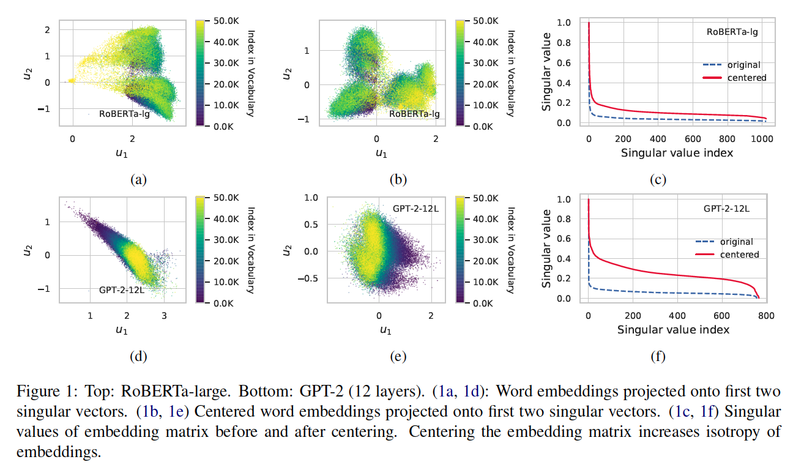

# Too Much in Common: Shifting of Embeddings in Transformer Language Models and its Implications
This repo provides the source code & data for our paper: \
_Too Much in Common: Shifting of Embeddings in Transformer Language Models and its Implications_



## Setup
To install torch version matching your system see the [official guide](https://pytorch.org/).

```
conda create -n tmic python=3.8 && conda activate tmic
conda install pytorch torchvision torchaudio cudatoolkit=11.1 -c pytorch -c conda-forge
conda install transformers numpy scipy scikit-learn pandas matplotlib seaborn -c conda-forge
chmod +x run.sh
```

## Running

### Replicate the experiments
To replicate the experiments from the paper run:

```
./run.sh
```
This will create the directories:
```
experiments/isotropy/
experiments/benchmarks/
experiments/plots/
```
if they do not yet exist. This is where the respective results can be found. 
Plots are also available to download from [here](https://drive.google.com/file/d/1b_Dv5m7s0-FrdriN5Oh4BF8ZwJs04YfH/view?usp=sharing).
(~75mb)

### Other running options

One can run the scripts for a specific model as:

```
python src/isotropy.py --model <model-name-from-hugging-face> --output <path-to-output-json-file>
python src/embeddings_benchmark.py --model <model-name-from-hugging-face> --output <path-to-output-json-file>
```

By default, if no arguments are provided, the experiments are executed for all models evaluated in the paper. 
In that case, the results are saved in `experiments/<isotropy|benchmarks>/dmYHMS.json`.

### Citation

```
@InProceedings{bis2021tmic,
  author =  {Daniel Biś and Maksim Podkorytov and Xiuwen Liu},
  title =   {Too Much in Common: Shifting of Embeddings in Transformer Language Models and its Implications},
  year =    {2021},  
  booktitle = {North American Chapter of the Association for Computational Linguistics (NAACL)},  
}
```

